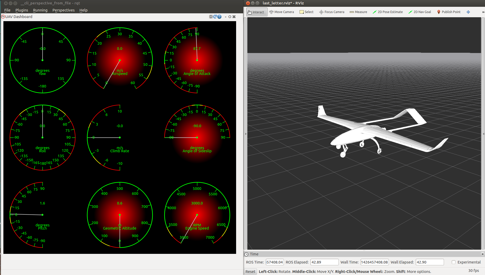
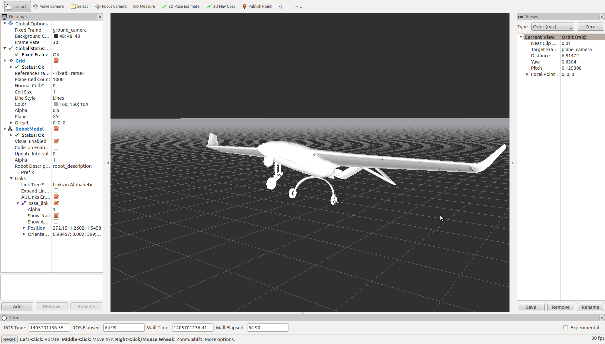

# `last_letter` : Unmanned Aerial Vehicle simulation and control packages

`last_letter` is a collection of [ROS](http://ros.org/) packages suitable for Unmanned Aerial Vehicle research, control algorithm development, non-linear physics simulation, Software-in-the-Loop (SIL) simulation and Hardware-in-the-Loop (HIL) simulation. It is developed by George Zogopoulos-Papaliakos.
This document serves as a table of contents for the documentation of this congregation of ROS packages.

## Gitter chatroom
 **(omnipresence not guaranteed)**

## Scientific background
Great effort has been exerted for the simulator to be as realistic as possible. To that goal, the project incorporates bibliography related to flight dynamics, physics modeling and sensor modeling. A congreggated document discussing the modeling of a fixed-wing UAV can be found in the [*Modeling a Fixed-Wing UAV*](https://github.com/Georacer/uav-modeling) Github project. It is a LaTeX project with a single .pdf output document.
Although `uav-modeling` is independent of `last-letter`, it will often be referred to in the documentation.

## Table of Contents

- [Compatibility](last_letter/doc/manual/compatibility.md)
- [Installation](last_letter/doc/manual/ll_installation.md)
- [Updating]

<!-- - [Packages](#packages)
	- [last_letter](#last_letter)
	- [uav_utils](#uav_utils)
	- [mathutils](#mathutils)
	- [rqt_dashboard](#rqt_dashboard)
- [Important Messages](#important-messages) -->

- How to Run
    - [Launching and arguments](last_letter/doc/manual/launchingAndParams.md)
	- Typical Scenarios
		- [As Simulator for the ArduPlane SITL](last_letter/doc/manual/ArduPlane_SITL.md)

<!-- 		- [RC Simulator](#rc_simulator)
		- [A Simple Autopilot](#a-simple-autopilot) -->
- [Parameter Files](last_letter/doc/manual/parameterFiles.md)
- Frames of Reference and Conventions

<!-- - [Environment Parameters](#environment-parameters) -->
<!-- - [Controller Parameters](#controller-parameters) -->
<!-- - [Sensor Parameters](#sensor-parameters) -->
<!-- - [License](#license) -->
<!-- - [Contributors](#contributors) -->

<!-- ## Packages

### last_letter

This is the core package, containing the physics and kinematics simulator and controller nodes. -->

<!-- ## How to Run

The last_letter/launch file contains a few template .launch files which can be used to raise multiple nodes while reading from several parameter files of your choice. Consult them in order to build your own .launch files. The proposed structure is to split the simulation and visualization launch files, since these two functions are functionally independent anyway.

### RC Simulator

For this scenario, you will need to have a joystick (or similar device visible to the "joy" ROS package) plugged in to your machine. You may need to configure the /dev/input/js* parameter to point to your controller. Running roslaunch last_letter launcher_ll.launch will start the simulator running the "last_letter" standard aircraft, visible in the rviz visualizer, under direct, manual user control. It will also open the "rqt_dashboard" plugin for rqt_gui, which contains virtual flight instruments. -->

##Screenshots
####Avionics panel and visualization of an aircraft pre-flight

####An aircraft 3D model during take-off

####An indicative rqt_graph showing the node and topic layout of the simulator
